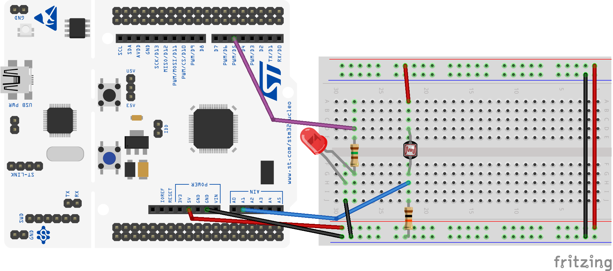
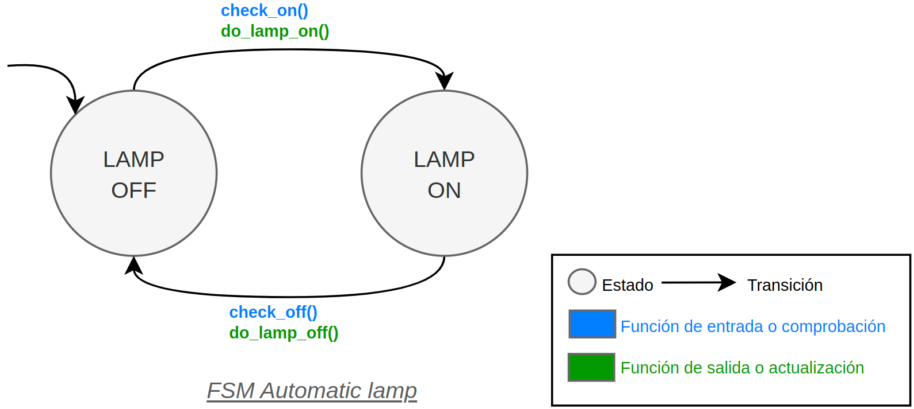
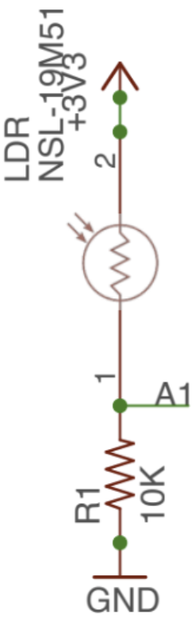
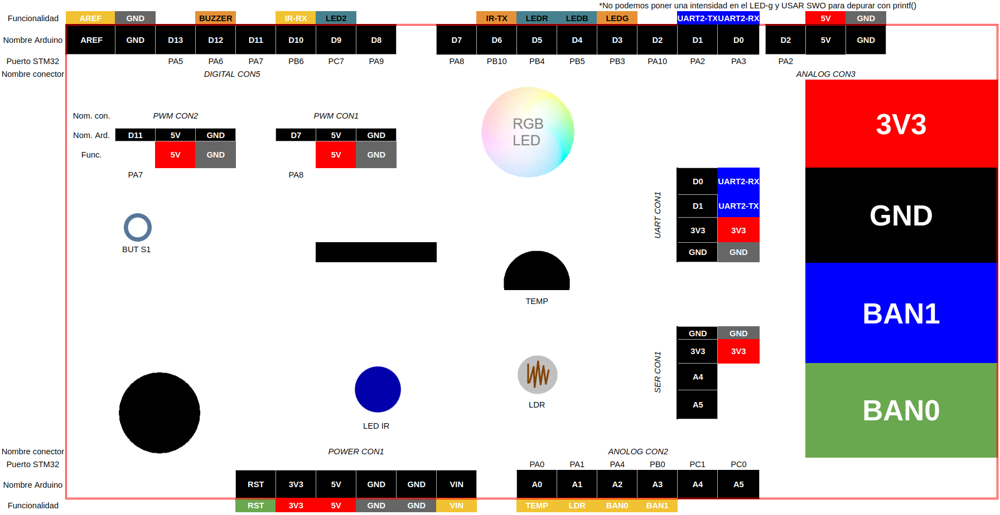

# Sistema de iluminación automática

Este proyecto implementa un sistema de iluminación automática con un sensor LDR y 2 LEDs. El sistema utiliza una FSM para gestionar los diferentes estados del sistema y el hardware. 

You can access the source code of the project in the following link: [Thermostat with FSM and ADC](https://github.com/ieinDieUpm/fsm_thermostat/tree/hal_version).

Puedes acceder al código fuente del proyecto en el siguiente enlace: [Sistema de iluminación automática con FSM y ADC](https://github.com/ieinDieUpm/fsm_automatic_lamp/tree/hal_version).

La configuración HW se muestra en la siguiente imagen:

El sistema usa una FSM para gestionar los diferentes estados del sistema y el hardware. Esta imagen muestra la FSM del sistema:

El sistema toma una medida cada vez que se activa su temporizador. La medida se realiza mediante el periférico ADC. El ADC está configurado para muestrear el sensor LDR en modo único. El temporizador está configurado en la función `    port_automatic_lamp_timer_setup()`. El temporizador está configurado para interrumpir cada segundo. El temporizador está configurado como indica la siguiente tabla:

| Parameter     | Value                                    |
| ------------- | ---------------------------------------- |
| Define label  | STM32F4_AUTOMATIC_LAMP_MEASUREMENT_TIMER |
| Timer         | TIM3                                     |
| Interrupt     | TIM3_IRQHandler                          |
| Time interval | 1 second                                 |
| Priority      | 2                                        |
| Subpriority   | 0                                        |

Puede generar tantos sistemas de iluminación como desee creando una nueva FSM y asignando los periféricos correspondientes al sistema. El sistema está implementado en el archivo `main.c`.

## Implementación HW

## Sensor LDR

El sensor LDR utilizado en el sistema es el NSL-19M51 (ver [hoja de datos del NSL-19M51](https://docs.rs-online.com/7251/0900766b8156674e.pdf)). El sensor está ubicado en la *shield* proporcionado por la universidad. El sensor está conectado con una resistencia de *pull-down* en el circuito como se muestra en la siguiente imagen:

El sensor se muestrea en modo único con un período de muestreo dado por las interrupciones de un temporizador. Todas las configuraciones del ADC son por defecto. El ADC está configurado para interrumpir cuando la conversión se completa. El ADC está configurado como indica la siguiente tabla:

| Parameter     | Value                           |
| ------------- | ------------------------------- |
| Define ID     | PORT_PORT_LDR_SENSOR_LAMP_ID_ID |
| Pin           | **Por determinar** (A1 Nucleo)  |
| ADC           | **Por determinar**              |
| Channel       | **Por determinar**              |
| Mode          | Analog                          |
| Pull up/ down | No push no pull                 |
| ISR           | ADC_IRQHandler()                |
| Priority      | 1                               |
| Subpriority   | 0                               |

## LEDs

Hay 2 LEDs para indicar el estado del sistema. Un **LED verde** (`PORT_PORT_LED_STATUS_LAMP_ID_LAMP_ID`) se utiliza para indicar que el sistema está funcionando cuando la luz no está encendida. Un **LED rojo** (`PORT_LED_LAMP_ID`) que hace las veces de la luz del sistema.

| Parameter     | Value                     |
| ------------- | ------------------------- |
| Define ID     | PORT_LED_STATUS_LAMP_ID   |
| Pin           | PA5 (LD2 on Nucleo board) |
| Mode          | Output                    |
| Pull up/ down | No push no pull           |

| Parameter     | Value                         |
| ------------- | ----------------------------- |
| Define ID     | PORT_LED_LAMP_ID              |
| Pin           | PB4 (D5 on Nucleo and shield) |
| Mode          | Output                        |
| Pull up/ down | No push no pull               |

## Funcionamiento detallado del sistema

El sistema está codificado según el diagrama de estados mostrado anteriormente. El sistema se comporta de la siguiente manera:

* El sistema se inicia en el estado `LAMP_OFF`. En este estado, el LED `PORT_LED_STATUS_LAMP_ID` está encendido y `PORT_LED_LAMP_ID` está apagado.
* Cada vez que salta la ISR del temporizador, su *callback* (`HAL_TIM_PeriodElapsedCallback()`) llama a `HAL_ADC_Start_IT()` para iniciar una conversión del sensor LDR. La ISR del ADC se activa cuando la conversión se completa. El *callback* de conversión de la ISR del ADC (`HAL_ADC_ConvCpltCallback()`) llama a `port_ldr_sensor_save_adc_value()` para gestionar el valor del sensor LDR. Esta función guarda el valor de impedancia del sensor LDR en el campo `resistance_ohms` del `PORT_LDR_SENSOR_LAMP_ID`.
* El sistema comprueba (`check_on()`) si el valor de impedancia del sensor cruza el umbral establecido en el campo `threshold_ldr_ohms`  de `PORT_LDR_SENSOR_LAMP_ID`. En el [ejercicio](ejercicio.md) deberá identificar si el umbral se cruza en el sentido de que el valor de impedancia del sensor LDR es mayor o menor que el umbral.
* Si se cruza el umbral, el sistema cambia al estado `LAMP_ON`. En este estado, el LED `PORT_LED_LAMP_ID` se enciende y el LED `PORT_LED_STATUS_LAMP_ID` se apaga.
* De manera análoga, en el estado `LAMP_ON`, el sistema comprueba (`check_off()`) si el valor de impedancia del sensor LDR cruza el umbral establecido en el campo `threshold_ldr_ohms` de `PORT_LDR_SENSOR_LAMP_ID`. Si se cruza el umbral, vuelve al estado `LAMP_OFF`, el LED `PORT_LED_STATUS_LAMP_ID` se enciende y el LED `PORT_LED_LAMP_ID` se apaga.

Mire la siguiente imagen para ver la *shield* donde se encuentra el LED rojo y el sensor LDR:

Vaya al [ejercicio](ejercicio.md) para realizar los cambios necesarios para que funcione correctamente.

## Referencias

- **[1]**: [Documentation available in the Moodle of the course](https://moodle.upm.es/titulaciones/oficiales/course/view.php?id=785#section-0)
- **[2]**: [Embedded Systems with ARM Cortex-M Microcontrollers in Assembly Language and C (Fourth Edition)](https://web.eece.maine.edu/~zhu/book/index.php) for explanations and examples of use of the ARM Cortex-M microcontrollers in C with CMSIS.
- **[3]**: [Programming with STM32: Getting Started with the Nucleo Board and C/C++](https://ingenio.upm.es/primo-explore/fulldisplay?docid=34UPM_ALMA51126621660004212&context=L&vid=34UPM_VU1&lang=es_ES&search_scope=TAB1_SCOPE1&adaptor=Local%20Search%20Engine&tab=tab1&query=any,contains,Programming%20with%20STM32:%20Getting%20Started%20with%20the%20Nucleo%20Board%20and%20C%2FC%2B%2B&offset=0) for examples of use of the STM32 microcontrollers with the HAL of ST.
- **[4]**: [The C Programming Language](https://ingenio.upm.es/primo-explore/fulldisplay?docid=34UPM_ALMA2151866130004212&context=L&vid=34UPM_VU1&lang=es_ES&search_scope=TAB1_SCOPE1&adaptor=Local%20Search%20Engine&isFrbr=true&tab=tab1&query=any,contains,C%20Programming%20Language)
- **[5]**: [Nucleo Boards Programming with th STM32CubeIDE](https://www.elektor.com/products/nucleo-boards-programming-with-the-stm32cubeide) for examples of use of the STM32 microcontrollers with the STM32CubeIDE.
